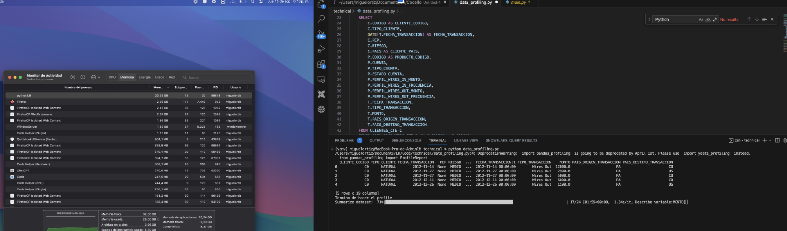
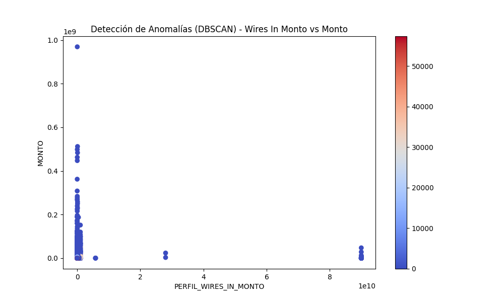

# Documentación del Proceso de Análisis de Datos para Bancolombia Panamá - Prueba Técnica

## 1. Introducción

Esta prueba técnica, realizada en agosto de 2024, tiene como objetivo evaluar la capacidad de manipulación y análisis de datos, así como la identificación de anomalías utilizando Python y motores de bases de datos. Se proporcionaron tres conjuntos de datos en formato CSV que contienen información sobre clientes, productos y transacciones realizadas por los clientes, totalizando miles de registros.

## 2. Carga y Transformación de Datos

Los archivos CSV fueron procesados y transformados utilizando Python antes de ser cargados en una base de datos SQLite para facilitar su análisis. A continuación, se describe el proceso seguido para cada archivo lo pueden ver en el `script.py` :

### 2.1. Archivo `CLIENTES.csv`

El archivo `CLIENTES.csv` presentaba inconsistencias en los valores de algunos campos, particularmente en el campo `RIESGO`, donde se utilizaban diferentes formatos para indicar el nivel de riesgo (por ejemplo, "MEDIO ALTO" y "MEDIO BAJO"). Para resolver esto, se realizaron las siguientes acciones:

- **Corrección de Valores Inconsistentes:** Se reemplazaron los espacios por guiones bajos en los valores de `RIESGO` para mantener la coherencia.
- **Carga en SQLite:** Luego de las correcciones, se cargaron los datos en la tabla `clientes` de la base de datos SQLite.

#### Código Python Utilizado

```python
import pandas as pd
import re

def corregir_archivo_clientes():
    file_path = './media/CLIENTES.csv'

    # Leer las líneas del archivo original
    with open(file_path, 'r', encoding='utf-8') as file:
        lines = file.readlines()

    # Corregir las líneas
    corrected_lines = []
    for line in lines:
        line = re.sub(r'MEDIO ALTO', 'MEDIO_ALTO', line)
        line = re.sub(r'MEDIO BAJO', 'MEDIO_BAJO', line)
        corrected_lines.append(line)

    # Guardar las líneas corregidas en un archivo temporal
    temp_file_path = 'CLIENTES_corrected.csv'
    with open(temp_file_path, 'w', encoding='utf-8') as file:
        file.writelines(corrected_lines)

    # Cargar el archivo corregido a un DataFrame de pandas
    df = pd.read_csv(temp_file_path)
    # Cargar el DataFrame a la base de datos SQLite (codigo simplificado)
    df.to_sql('clientes', con=sqlite_connection, if_exists='replace', index=False)
```

### 2.2. Archivo `PRODUCTOS.csv`

El archivo `PRODUCTO.csv` fue cargado utilizando el delimitador de comas. No fue necesario realizar correcciones significativas, pero se ajustaron los nombres de las columnas para asegurar la consistencia.

#### Código Python Utilizado

```python
    def cargar_archivo_productos():
    file_path = './media/PRODUCTO.csv'

    # Leer el archivo CSV usando comas como delimitador
    df = pd.read_csv(file_path, delimiter=',', encoding='utf-8')

    # Ajustar los nombres de las columnas según el DataFrame actual
    df.columns = [
        'CODIGO',
        'CUENTA',
        'TIPO_CUENTA',
        'ESTADO_CUENTA',
        'PERFIL_WIRES_IN_MONTO',
        'PERFIL_WIRES_IN_FRECUENCIA',
        'PERFIL_WIRES_OUT_MONTO',
        'PERFIL_WIRES_OUT_FRECUENCIA'
    ]

    return df
```


### 2.3. Archivo `TRANSACCIONES.csv`

El archivo `TRANSACCIONES.csv` contenía caracteres no deseados, como apóstrofes, en varios campos. Estos caracteres fueron eliminados para asegurar la correcta carga de los datos en SQLite.

Código Python Utilizado

```python
def cargar_archivo_transacciones():
    file_path = './media/TRANSACCIONES.csv'

    # Leer el archivo CSV usando tabuladores como delimitador
    df = pd.read_csv(file_path, delimiter='\t', encoding='utf-8')

    # Eliminar el carácter ' en el campo CUENTA y otros campos
    df['CUENTA'] = df['CUENTA'].str.replace("'", "")
    df['TIPO_TRANSACCION'] = df['TIPO_TRANSACCION'].str.replace("'", "")
    df['PAIS_ORIGEN_TRANSACCION'] = df['PAIS_ORIGEN_TRANSACCION'].str.replace("'", "")
    df['PAIS_DESTINO_TRANSACCION'] = df['PAIS_DESTINO_TRANSACCION'].str.replace("'", "")

    # Ajustar los nombres de las columnas según el DataFrame actual
    df.columns = [
        'CUENTA',
        'FECHA_TRANSACCION',
        'TIPO_TRANSACCION',
        'MONTO',
        'PAIS_ORIGEN_TRANSACCION',
        'PAIS_DESTINO_TRANSACCION'
    ]

    return df
```

## 3. Consulta SQL de Unión de Datos

### Tabla: CLIENTES

| Nombre del Campo    | Tipo   | Not Null | Descripción                                                                                                       |
|---------------------|--------|----------|-------------------------------------------------------------------------------------------------------------------|
| CODIGO              | TEXT   | No       | Código del cliente. Es alfanumérico y único para cada cliente.                                                    |
| TIPO_CLIENTE        | TEXT   | No       | Tipo de cliente. Puede ser ‘NATURAL’ (persona natural) o ‘JURIDICO’ (persona jurídica).                           |
| FECHA_ACTUALIZACION | DATE   | No       | Fecha de la última actualización de los datos del cliente. Formato YYYYMMDD.                                      |
| PEP                 | TEXT   | No       | Permiso Especial de Permanencia. Puede ser ‘SI’, ‘NO’ o NULL.                                                     |
| RIESGO              | TEXT   | No       | Nivel de riesgo asociado al cliente. Valores posibles: ‘MEDIO’, ‘MEDIO_BAJO’, ‘BAJO’, ‘ALTO’, ‘MEDIO_ALTO’, NULL. |
| PAIS                | TEXT   | No       | País del cliente, en formato de código ISO 3166-1 (ej. ‘CO’, ‘SV’, ‘PA’).                                         |


### Tabla: PRODUCTOS
| Nombre del Campo           | Tipo    | Not Null | Descripción                                                                                 |
|----------------------------|---------|----------|---------------------------------------------------------------------------------------------|
| CODIGO                     | TEXT    | No       | Código del producto asociado al cliente. Es alfanumérico.                                   |
| CUENTA                     | TEXT    | No       | Número de cuenta asociada al producto. Es alfanumérico.                                     |
| TIPO_CUENTA                | TEXT    | No       | Tipo de cuenta. Valores posibles: ‘CUENTA’, ‘CDT’, ‘PRESTAMO’, ‘LEASING’.                   |
| ESTADO_CUENTA              | TEXT    | No       | Estado de la cuenta. Valores posibles: ‘CANCELADO’, ‘ACTIVO’, ‘BLOQUEADO’.                  |
| PERFIL_WIRES_IN_MONTO      | INTEGER | No       | Monto total de giros u operaciones internacionales de entrada. Es numérico.                 |
| PERFIL_WIRES_IN_FRECUENCIA | INTEGER | No       | Frecuencia o cantidad de giros u operaciones internacionales de entrada. Es numérico.       |
| PERFIL_WIRES_OUT_MONTO     | INTEGER | No       | Monto total de giros u operaciones internacionales de salida. Es numérico.                  |
| PERFIL_WIRES_OUT_FRECUENCIA| INTEGER | No       | Frecuencia o cantidad de giros u operaciones internacionales de salida. Es numérico.        |

### Tabla: TRANSACCIONES
| Nombre del Campo            | Tipo    | Not Null | Descripción                                                                                 |
|-----------------------------|---------|----------|---------------------------------------------------------------------------------------------|
| CUENTA                      | TEXT    | No       | Número de cuenta desde la que se realizó la transacción. Es alfanumérico.                   |
| FECHA_TRANSACCION           | TEXT    | No       | Fecha en la que se realizó la transacción. Es de tipo datetime en formato YYYY-MM-DD.        |
| TIPO_TRANSACCION            | TEXT    | No       | Tipo de transacción. El valor siempre es ‘Wires Out’.                                       |
| MONTO                       | INTEGER | No       | Monto de la transacción. Es un valor numérico.                                              |
| PAIS_ORIGEN_TRANSACCION     | TEXT    | No       | País de origen de la transacción, en formato de código ISO 3166-1 (ej. ‘CO’, ‘SV’, ‘PA’).    |
| PAIS_DESTINO_TRANSACCION    | TEXT    | No       | País de destino de la transacción, en formato de código ISO 3166-1 (ej. ‘CO’, ‘SV’, ‘PA’).   |


Después de realizar las transformaciones necesarias, los datos fueron cargados en una base de datos SQLite en las tablas clientes, productos y transacciones.

```sql
WITH CLIENTES_CTE AS (
    SELECT *
    FROM clientes
),
PRODUCTOS_CTE AS (
    SELECT *
    FROM productos
),
TRANSACCIONES_CTE AS (
    SELECT *
    FROM transacciones
),
UNION_CTE AS (
    SELECT 
        C.CODIGO, 
        C.NOMBRE, 
        P.CUENTA,
        T.MONTO,
        T.TIPO_TRANSACCION
    FROM CLIENTES_CTE C
    INNER JOIN PRODUCTOS_CTE P ON C.CODIGO = P.CODIGO
    INNER JOIN TRANSACCIONES_CTE T ON P.CUENTA = T.CUENTA
)
SELECT * FROM UNION_CTE;
```

### Descripción de la Consulta

- **CLIENTES_CTE:** Selecciona todos los registros de la tabla `clientes`, preparándolos para su unión con las otras tablas.
- **PRODUCTOS_CTE:** Selecciona todos los registros de la tabla `productos`.
- **TRANSACCIONES_CTE:** Selecciona todos los registros de la tabla `transacciones`.
- **UNION_CTE:** Realiza la unión de las tres tablas usando `INNER JOIN` para relacionar clientes con productos a través del campo `CODIGO`, y luego unir productos con transacciones a través del campo `CUENTA`.

Esta consulta es fundamental para integrar la información y llevar a cabo un análisis más profundo.

## 4. Análisis Descriptivo y Detección de Anomalías

### 4.1. Uso de `pandas-profiling`

Se utilizó la herramienta `pandas-profiling` para generar un análisis descriptivo exhaustivo de los datos. El proceso de generación del perfil fue intensivo en recursos, utilizando aproximadamente 20 GB de memoria RAM. Los insights principales incluyeron la distribución de las transacciones y la detección de valores atípicos.




### 4.2. Identificación de Anomalías

Algunas anomalías identificadas incluyen:

- **Transacciones sin país de origen o destino:** Transacciones que no tienen un valor en los campos `PAIS_ORIGEN_TRANSACCION` o `PAIS_DESTINO_TRANSACCION`.
- **Montos de transacción inusuales:** Transacciones con montos que exceden significativamente el rango típico para un cliente determinado.


	


## 5. Conclusión

En resumen, el análisis permitió identificar inconsistencias y posibles riesgos en los datos de transacciones, así como anomalías que podrían requerir mayor investigación. Se recomienda realizar un análisis más detallado de las transacciones inusuales y considerar ajustes en los procesos de captura de datos para mejorar la calidad de los mismos.
